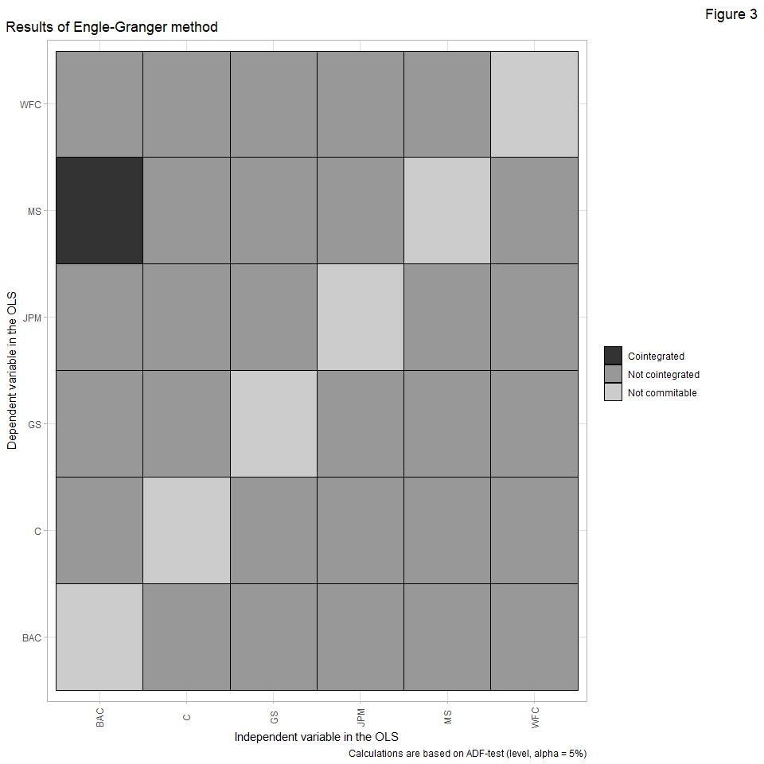
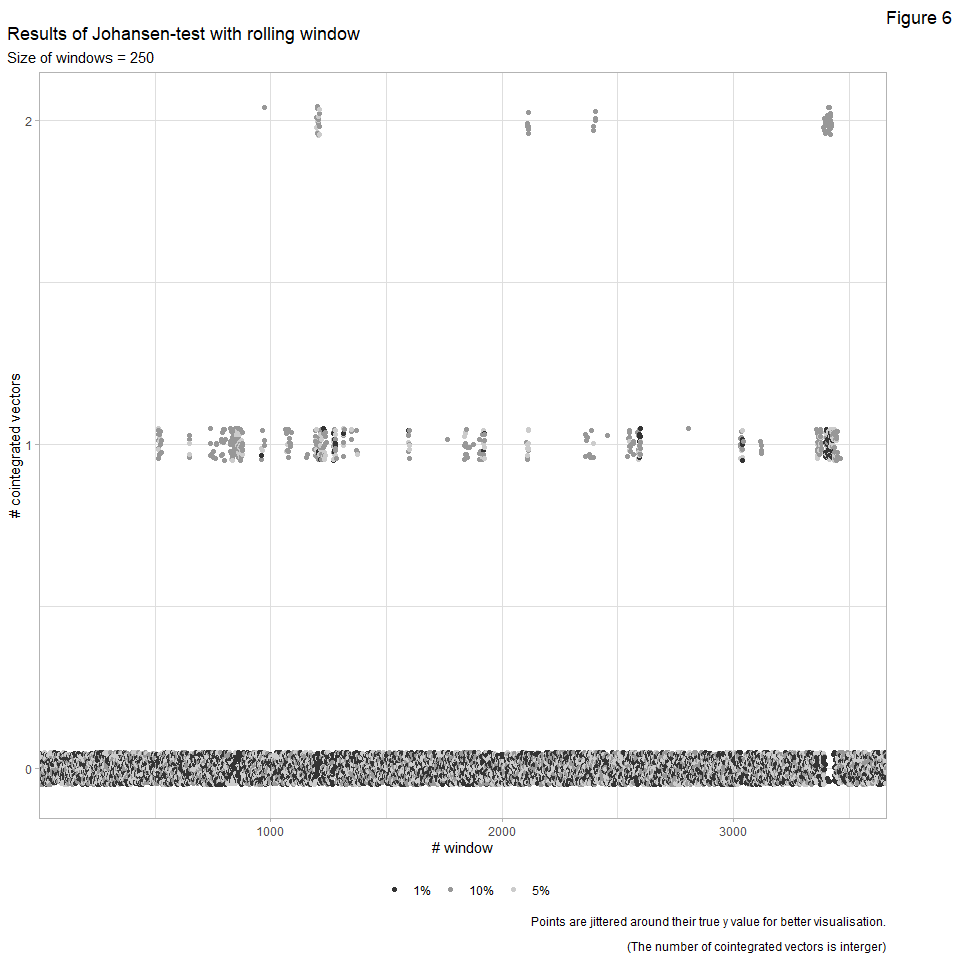

Exercise-2
================
Granát Marcell
2020 07 14

## Feladat leírása

Az Excel a következő információkat tartalmazza:

6 amerikai bank (JPMorgan Chase, Bank of America, Citigroup, Wells
Fargo, Goldman Sachs, Morgan Stanley) close open high low ask és bid
árfolyamait. 2003.12.10 és 2019.06.25 között. Az információk a
Bloombergről lettek letöltve. Számodra elegendő lesz a close árakat
használni ez elemzés során\!

A csatolt Excel adatok alapján a következő feladatokat végezd el:

1)  In-sample elemzés: Vizsgáld meg (a teljes mintán) a kointegrációs
    kapcsolatokat páronként az Engle-Granger teszttel illetve a Johansen
    teszttel (egyszerre az összes idősorron végezd el a tesztet).

Interpretáld a kapott eredményeket valamilyen módon (ábra, táblázat …).

2)  Out-of-sample elemzés: Végezz el egy görgetett ablakos kointegrációs
    tesztet (tesztsorozatot) három idősoron (JPMorgan Chase, Bank of
    America, Citigroup) mind az Engle-Granger módszerrel (páronként),
    mind a Johansen teszttel. Interpretáld a kapott eredményeket
    valamilyen módon (ábra, táblázat …).

A görgetett ablak mérete legyen 250 nap. Minden egyes lépésnél
frissüljön a teszthez használt modell\! Ha szükséges nézz utána hogy a
görgetett ablak kifejezés (rolling window) milyen modellezési eljárást
takar\!

3)  Pár mondatban foglald össze hogy az előző egyszerű elemzésnek milyen
    kapcsolata van az általad korábban feldolgozott 2 cikkel.

4)  Pár mondatban foglald össze hogy milyen egyéb elemzést lehetne még
    ezeken az adatokon elvégezni (amelyek ugyancsak kapcsolódnak ezekhez
    a cikkekhez).

1-2 hasznos függvény:

  - <https://www.quantstart.com/articles/Johansen-Test-for-Cointegrating-Time-Series-Analysis-in-R/>
  - <https://www.rdocumentation.org/packages/aTSA/versions/3.1.2/topics/coint.test>

## Setup

``` r
library(tidyverse)
library(urca)
theme_set(theme_light() + theme(
  legend.title = element_blank(),
  plot.title.position = "plot"
))
load("Exercise-2.RData") # datas from Bankdata.xlsx
```

## Explorer the datas

``` r
Bankdata %>%
  pivot_longer(-1) %>%
  ggplot(aes(x = Date, y = value)) +
  geom_line() +
  facet_wrap(vars(name), nrow = 3, scales = "free")
```

<!-- -->

## In-sample: Engle-Granger method

``` r
Bankdata %>%
  select(-1) %>%
  apply(2, function(x) { # # of differences required for stationarity to each series
    forecast::ndiffs(x, test = "adf", alpha = 0.05, type = "level")
  })
```

    JPM BAC   C WFC  GS  MS 
      1   1   1   1   1   1 

``` r
Bankdata %>%
  select(-1) %>%
  apply(2, function(x) { # # of differences required for stationarity to each series
    diff(x)
  }) %>%
  data.frame() %>%
  mutate(
    Date = tail(Bankdata$Date, -1)
  ) %>%
  pivot_longer(-Date) %>%
  ggplot(aes(x = Date, y = value)) +
  geom_line() +
  facet_wrap(vars(name), nrow = 3, scales = "free")
```

<!-- -->

``` r
cointegration_tests <- function(df, test, type, alpha) { # test cointegrity for all combination in a df
  ndiff_df <- df %>%
    select(-1) %>%
    apply(2, function(x) { # # of differences required for stationarity to each series
      forecast::ndiffs(x, test = test, alpha = alpha, type = type)
    })

  v <- df %>% select(-1) %>% # remove year ---> IT MUST BE IN THE INPUT DF !
    names(.)
  df2 <- expand.grid(v, v) %>%
    rename_all(funs(c("y", "x"))) %>%
    mutate(
      y = as.character(y),
      x = as.character(x),
      ndiff = ifelse(ndiff_df[y] == ndiff_df[x], ndiff_df[y], 0),
      ndiff = ifelse(y == x, 0, ndiff) # if series are the same, put 0
    )

  v <- vector()
  for (i in seq(nrow(df2))) {
    if (df2[i, 3] != 0) {
      if (lm(y ~ x, data = rename_all(data.frame(y = df[df2[i, 1]], x = df[df2[i, 2]]), funs(c("y", "x")))) %>%
        broom::augment() %>% .$.resid %>%
        forecast::ndiffs(test = test, alpha = alpha, type = type) == df2[i, 3] - 1) {
        v[i] <- 2 # 2 ---> series are cointegrated
      } else {
        v[i] <- 1 # 1 ---> not cointegrated, but test is commitable
      }
    } else {
      v[i] <- 0 # 0 ---> test is not commitable [I(0) OR not the same I() order OR series are the same]
    }
  }
  df2 %>%
    mutate(
      cointegration = v
    ) %>%
    select(y, x, cointegration)
}
```

``` r
cointegration_tests(df = Bankdata, test = "adf", type = "level", 0.05) %>%
  mutate(
    cointegration = case_when(
      cointegration == 0 ~ "Not commitable",
      cointegration == 1 ~ "Not cointegrated",
      cointegration == 2 ~ "Cointegrated"
    ),
    cointegration = factor(cointegration, levels = c("Cointegrated", "Not cointegrated", "Not commitable"))
  ) %>%
  ggplot() +
  geom_tile(aes(x = x, y = y, fill = cointegration), color = "black") +
  scale_fill_grey() +
  theme(
    axis.text.x = element_text(angle = 90, vjust = 0.45),
  ) +
  labs(
    y = "Dependent variable in the OLS",
    x = "Independent variable in the OLS",
    title = "Results of Engle-Granger method",
    caption = "Calculations are based on ADF-test (level, alpha = 5%)"
  )
```

<!-- -->

## In-sample: Johansen-test

``` r
Bankdata %>%
  select(-1) %>%
  ca.jo(type = "eigen", K = 5, ecdet = "none", spec = "longrun") %>%
  summary()
```

``` 

###################### 
# Johansen-Procedure # 
###################### 

Test type: maximal eigenvalue statistic (lambda max) , with linear trend 

Eigenvalues (lambda):
[1] 0.0135570305 0.0069968410 0.0035850170 0.0027030985 0.0010127923
[6] 0.0000933627

Values of teststatistic and critical values of test:

          test 10pct  5pct  1pct
r <= 5 |  0.36  6.50  8.18 11.65
r <= 4 |  3.96 12.91 14.90 19.19
r <= 3 | 10.57 18.90 21.07 25.75
r <= 2 | 14.03 24.78 27.14 32.14
r <= 1 | 27.43 30.84 33.32 38.78
r = 0  | 53.32 36.25 39.43 44.59

Eigenvectors, normalised to first column:
(These are the cointegration relations)

            JPM.l5     BAC.l5       C.l5     WFC.l5       GS.l5       MS.l5
JPM.l5   1.0000000  1.0000000  1.0000000  1.0000000   1.0000000  1.00000000
BAC.l5   5.5131865 -4.0456849 -0.8939931 -2.6058805 -15.0710638  0.37760026
C.l5     0.4921135  0.4226470  0.1706904  0.1824141  -1.4494749 -0.01292972
WFC.l5  -1.3498414 -1.1603305  1.0004376  2.3847327 -16.8008836 -1.65959477
GS.l5    2.5639090  0.5557019 -0.3398715  0.4928708   0.3037046 -0.09476301
MS.l5  -15.2020063 -1.6029892 -1.7058256  0.5319127  13.2767994 -0.09533364

Weights W:
(This is the loading matrix)

             JPM.l5      BAC.l5         C.l5        WFC.l5        GS.l5
JPM.d -6.004705e-04 0.001098256 7.239467e-05 -3.350678e-05 5.489841e-05
BAC.d -7.502493e-04 0.002320100 4.877812e-04  2.862100e-05 2.317906e-05
C.d   -4.882348e-03 0.001436784 7.690138e-03  2.199615e-05 2.103699e-04
WFC.d -2.583521e-04 0.002001559 1.236464e-05 -2.660815e-04 4.833466e-05
GS.d  -4.801280e-03 0.002422827 1.958353e-03 -1.304578e-03 4.388041e-05
MS.d  -4.760081e-05 0.001607078 1.385564e-03 -2.461575e-04 1.373194e-05
              MS.l5
JPM.d -0.0005947530
BAC.d -0.0001819405
C.d   -0.0004501062
WFC.d -0.0001978639
GS.d  -0.0015802845
MS.d  -0.0004331537
```

Number of cointegrated vectors: 1.

## Out-of-sample: Engle-Granger method

``` r
for (i in 1:(nrow(Bankdata) - 249)) {
  if (i == 1) {
    cointegration_tests_rw <- mutate(
      cointegration_tests(df = Bankdata[i:(i + 249), 1:4], test = "adf", type = "level", alpha = 0.05),
      t = i
    )
  } else {
    cointegration_tests_rw <- rbind(cointegration_tests_rw, mutate(
      cointegration_tests(df = Bankdata[i:(i + 249), 1:4], test = "adf", type = "level", alpha = 0.05),
      t = i
    ))
  }
}
```

``` r
cointegration_tests_rw %>%
  filter(y != x) %>%
  ggplot(aes(x = t, y = cointegration)) +
  geom_point() +
  facet_grid(cols = vars(x), rows = vars(y)) +
  scale_y_continuous(breaks = c(0, 1, 2), labels = c("Not commitable", "Not cointegrated", "Cointegrated")) +
  labs(
    title = "Results of Engle-Granger method with rolling window",
    subtitle = "Size of windows = 250",
    y = "Result of the test",
    x = "# window",
    caption = "Calculations are based on ADF-test (level, alpha = 5%)\n
    Depedent variables (in the OLS) are placed horizontal, independents are vertical."
  )
```

<!-- -->

``` r
merge(expand.grid(1:(nrow(Bankdata) - 249), c(0, 1, 2)) %>% rename_all(funs(c("t", "cointegration"))),
  cointegration_tests_rw %>% filter(y != x) %>%
    group_by(t, cointegration) %>%
    summarise(n = n()),
  all.x = T
) %>%
  mutate(
    n = ifelse(is.na(n), 0, n),
    cointegration = case_when(
      cointegration == 0 ~ "Not commitable",
      cointegration == 1 ~ "Not cointegrated",
      cointegration == 2 ~ "Cointegrated"
    ),
    cointegration = factor(cointegration, levels = c("Cointegrated", "Not cointegrated", "Not commitable"))
  ) %>%
  ggplot() +
  geom_area(aes(x = t, y = n, fill = cointegration)) +
  scale_x_continuous(expand = c(0, 0)) +
  scale_y_continuous(expand = c(0, 0)) +
  theme(
    legend.position = "bottom"
  ) +
  labs(
    title = "Summary results of Engle-Granger method with rolling window",
    subtitle = "Size of windows = 250",
    y = "# pairs with the result",
    x = "# window",
    caption = "Calculations are based on ADF-test (level, alpha = 5%).\n
    # total pairs are 6."
  ) +
  scale_fill_grey()
```

<!-- -->

## Out-of-sample: Johansen-test

``` r
johansen_tests_rw <- data.frame(t = 1:(nrow(Bankdata) - 249)) %>% mutate(
  pct10 = NA, pct5 = NA, pct1 = NA
)

for (i in 1:(nrow(Bankdata) - 249)) {
  if (i == 1) {
    johansen_critical_values <- ca.jo(
      x = Bankdata[i:(i + 249), 2:4], type = "eigen",
      K = 5, ecdet = "none", spec = "longrun"
    )@cval
  }
  johansen_tests_rw[i, 2] <- which.max(rev(ca.jo(
    x = Bankdata[i:(i + 249), 2:4], type = "eigen",
    K = 5, ecdet = "none", spec = "longrun"
  )@teststat) < rev(johansen_critical_values[, 1])) - 1
  johansen_tests_rw[i, 3] <- which.max(rev(ca.jo(
    x = Bankdata[i:(i + 249), 2:4], type = "eigen",
    K = 5, ecdet = "none", spec = "longrun"
  )@teststat) < rev(johansen_critical_values[, 2])) - 1
  johansen_tests_rw[i, 4] <- which.max(rev(ca.jo(
    x = Bankdata[i:(i + 249), 2:4], type = "eigen",
    K = 5, ecdet = "none", spec = "longrun"
  )@teststat) < rev(johansen_critical_values[, 3])) - 1
}
```

``` r
johansen_tests_rw %>%
  pivot_longer(-1) %>%
  mutate(
    name = case_when(
      name == "pct1" ~ "1%",
      name == "pct5" ~ "5%",
      name == "pct10" ~ "10%"
    )
  ) %>%
  ggplot(aes(x = t, y = value, color = name)) +
  geom_jitter(width = 0, height = 0.05) +
  scale_color_grey() +
  theme(
    legend.position = "bottom"
  ) +
  scale_y_continuous(breaks = c(0, 1, 2)) +
  scale_x_continuous(expand = c(0, 0)) +
  labs(
    title = "Results of Johansen-test with rolling window",
    subtitle = "Size of windows = 250",
    y = "# cointegrated vectors",
    x = "# window",
    caption = "Points are jittered around their true y value for better visualisation.\n
    (The number of cointegrated vectors is interger)"
  )
```

<!-- -->
